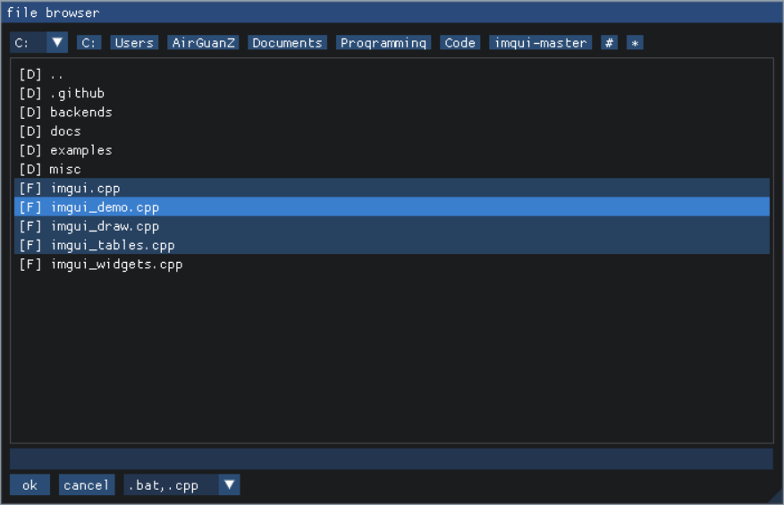

# imgui-filebrowser

[imgui-filebrowser](https://github.com/AirGuanZ/imgui-filebrowser) is a simple file browser implementation for [dear-imgui](https://github.com/ocornut/imgui).



## Getting Started

imgui-filebrowser is header-only and must be included after imgui.h:

```cpp
#include <imgui.h>
#include <imfilebrowser.h>
```

Instead of creating a file dialog by a immediate function call, you need to create a `ImGui::FileBrowser` instance, open it with member function `Open()`, and call `Display()` in each frame. Here is a simple example:

```cpp
#include <imgui.h>
#include <imfilebrowser.h>

int main()
{
    //...initialize rendering window and imgui
    
    // create a file browser instance
    ImGui::FileBrowser fileDialog;
    
    // (optional) set browser properties
    fileDialog.SetTitle("title");
    fileDialog.SetTypeFilters({ ".h", ".cpp" });
    
    // mainloop
    while(continueRendering)
    {
        //...do other stuff like ImGui::NewFrame();
        
        if(ImGui::Begin("dummy window"))
        {
            // open file dialog when user clicks this button
            if(ImGui::Button("open file dialog"))
                fileDialog.Open();
        }
        ImGui::End();
        
        fileDialog.Display();
        
        if(fileDialog.HasSelected())
        {
            std::cout << "Selected filename" << fileDialog.GetSelected().string() << std::endl;
            fileDialog.ClearSelected();
        }
        
        //...do other stuff like ImGui::Render();
    }
    
    //...shutdown
}
```

## Options

Various options can be combined with '|' and passed to the constructor:

```cpp
enum ImGuiFileBrowserFlags_
{
    ImGuiFileBrowserFlags_SelectDirectory  = 1 << 0, // select directory instead of regular file
    ImGuiFileBrowserFlags_EnterNewFilename = 1 << 1, // allow user to enter new filename when selecting regular file
    ImGuiFileBrowserFlags_NoModal          = 1 << 2, // file browsing window is modal by default. specify this to use a popup window
    ImGuiFileBrowserFlags_NoTitleBar       = 1 << 3, // hide window title bar
    ImGuiFileBrowserFlags_NoStatusBar      = 1 << 4, // hide status bar at the bottom of browsing window
    ImGuiFileBrowserFlags_CloseOnEsc       = 1 << 5, // close file browser when pressing 'ESC'
    ImGuiFileBrowserFlags_CreateNewDir     = 1 << 6, // allow user to create new directory
};
```

